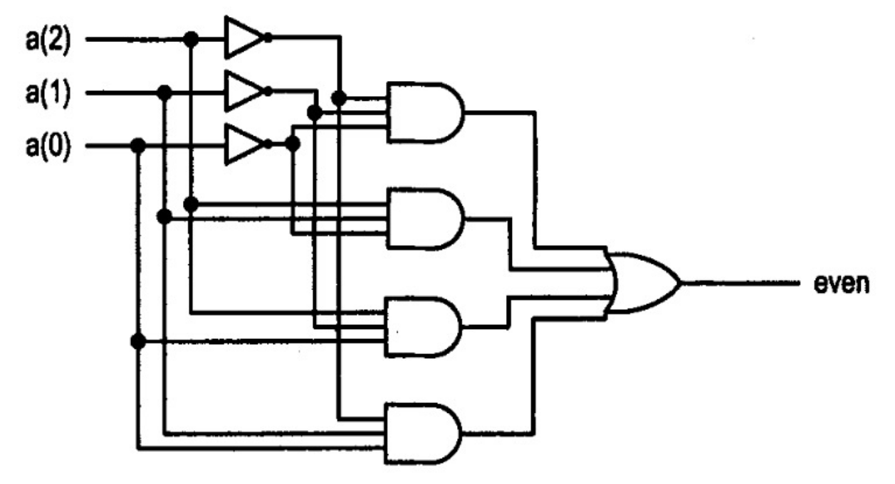

# 2020-1 AV1 Simulado

Simulado avaliação 1 - Elementos de Sistemas

- **Trabalhar sozinho**
- **20 min**
- **Ficar conectado no canal geral (para ouvir instruções)**
- **LEMBRE DE REALIZAR COMMIT (A CADA QUESTÃO) E DAR PUSH AO FINALIZAR**

## Começando

Você deve:

1. clonar o repositório que foi gerado pelo link (e trabalhar nele)
1. editar o arquivo `ALUNO.json`
1. não esqueça de dar `commit` e `push` a cada questão

> Todas as questões possuem testes. Vocês devem editar o arquivo `config_testes.txt` para inserir o módulo no teste. A simulação e o teste deve ser executada pelo comando `./testeAV1.py`

## Avaliação

As questões possuem um arquivo de `.vhd` e devem ser implementadas nele
e testadas com o script:

```
./testeAV1.py
```

## Questão 1

| Arquivo   | pnts   |
| -------   | ----   |
| `q1.vhd`  | 8 (HW) |
| `rtl.png` | 2 (HW) |

O circuito a seguir implementa um verificador de paridade de um vetor de 3 bits, onde even = `1` quando a soma dos bits do vetor a (a2,a1,a0) forem par e `0` caso contrário.

a) (8 HW) Escreva em VHDL uma representação do circuito verificador de paridade (`src/q1.vhd`).

b) (4 HW) Gere o RTL do circuito e salve no repositório com o nome: `rtl.png`




## Questão 2

| Arquivo      | pnts    |
| -------      | ----    |
| `src/q2.vhd` | 10 (HW) |

Você resolveu melhorar a ULA do Z01.1, para isso irá avaliar a ideia em uma versão simplificada que opera apenas com **dois bits de largura**. Sua ideia foi a de adicionar informações que comparam a entrada `X` com a entrada `Y` da ULA, fornecendo os seguintes sinais: `XeqY` (x igual a y) e `XltY` (x menor que y).

- `XeqY = 1` quando a entrada X for igual a entrada Y (`X == Y`)
- `XltY = 1` quando a entrada X for menor que a entrada Y (`X < Y`)

O componente a ser criado possui a estrutura a seguir (entity da `q2.vhd`):

```
 x1,x0 |------------|
  -/-->|            |--> XeqY
       | Comparador | 
 y1,y0 |            |
  -/-->|            |--> XltY
       |------------|
```

Escreva em VHDL o código que implementa o comparador (`src/q2.vnd`).

> Dica
>   - Faça a tabela verdade, encontre as equações e implemente em VHDL.
>   - X e Y são entradas de 2 bits cada
>   - XeqY e XltY são saídas de 1 bit cada
